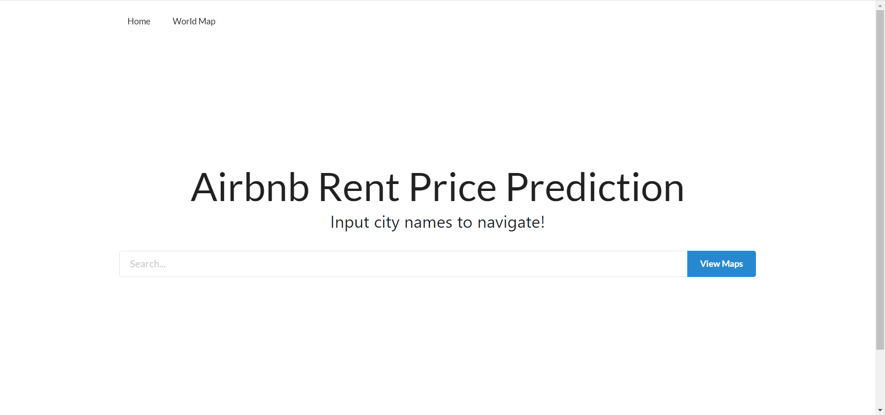
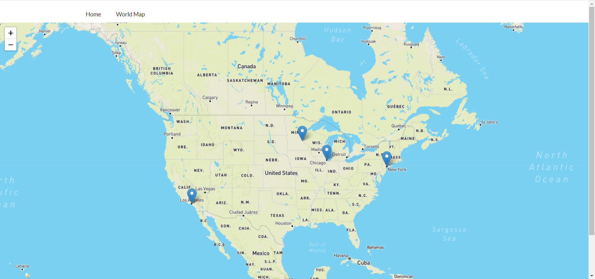
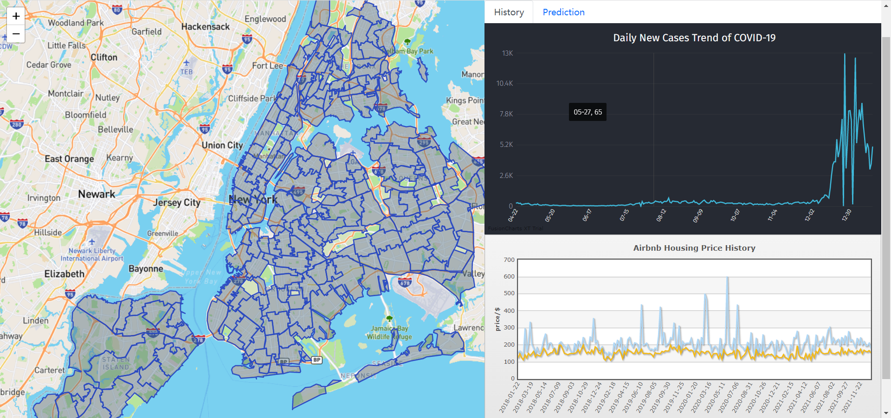
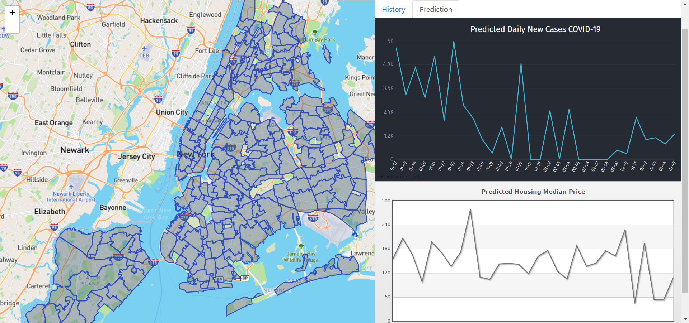

# Airbnb-Rent-Price-Prediction

## Brief Description

As the COVID-19 ravages the world, things of all aspects of life are deeply influenced, as well as the housing price. This project aims to demonstrate the historical and 
prediction data of covid new cases and housing prices which is represented by Airbnb prices. The predicted covid data is predicted with its own historical data, and the 
predicted housing prices take both covid and historical housing prices into consideration.

## System Architecture

The frontend of this project is written by React 17.0.2, map is provided by Leaflet Map and charts are rendered by FusionCharts.

The backend is constructed by SpringBoot 2.6.2 with Tomcat as the server.

We choose MySQL as our database, the MyBatis and Druid are used to connect database for backend.

We process and predict the data with Python. The raw data is first cleaned and stored in database. Then the long short-term memory (LSTM) model provided by Keras is used to do 
the prediction. The scripts of data sink and prediction should be run periodically with scheduler like Airflow.

## Website Demonstration

Home Page.

World Map.

Detailed city view and charts.

## Table Construction Details in Database

### covid

| Attributes | Settings |
|------|-------|
| id | int AUTO_INCREMENT |
| city | varchar(20) |
| state | varchar(20) |
| country | varchar(30) |
| confirmed | int unsigned |
| newcase | int unsigned |
| updatetime | datetime |
| updatetimeint | int unsigned |

With primary key(id) and char set UTF8MB4.

### housing_update_record

| Attributes | Settings |
|------|-------|
| id | int AUTO_INCREMENT |
| city | varchar(20) |
| date | datetime |

With primary key(id) and char set UTF8MB4.

### housing_raw

| Attributes | Settings |
|------|-------|
| id | int AUTO_INCREMENT |
| city | varchar(20) |
| state | varchar(20) |
| country | varchar(30) |
| std_price | double |
| date | datetime |
| date_int | int unsigned |

With primary key(id) and char set UTF8MB4.

### housing_count

| Attributes | Settings |
|------|-------|
| id | int AUTO_INCREMENT |
| city | varchar(20) |
| state | varchar(20) |
| country | varchar(30) |
| avg_price | double |
| median_price | double |
| date | datetime |
| date_int | int unsigned |

With primary key(id) and char set UTF8MB4.

### housing_count_comp

| Attributes | Settings |
|------|-------|
| id | int AUTO_INCREMENT |
| city | varchar(20) |
| state | varchar(20) |
| country | varchar(30) |
| avg_price | double |
| median_price | double |
| date | datetime |
| date_int | int unsigned |

With primary key(id) and char set UTF8MB4.

### housing_count_week

| Attributes | Settings |
|------|-------|
| id | int AUTO_INCREMENT |
| city | varchar(20) |
| state | varchar(20) |
| country | varchar(30) 
| week_avg_price | double |
| week_median_price | double |
| date | datetime |
| date_int | int unsigned |

With primary key(id) and char set UTF8MB4.

### covid_prediction

| Attributes | Settings |
|------|-------|
| id | int AUTO_INCREMENT |
| city | varchar(20) |
| state | varchar(20) |
| country | varchar(30) |
| predicted_newcases | int unsigned |
| date | datetime |
| date_int | int unsigned |

With primary key(id) and char set UTF8MB4.

### housing_median_prediction

| Attributes | Settings |
|------|-------|
| id | int AUTO_INCREMENT |
| city | varchar(20) |
| state | varchar(20) |
| country | varchar(30) |
| predicted_median_price | double |
| date | datetime |
| date_int | int unsigned |
